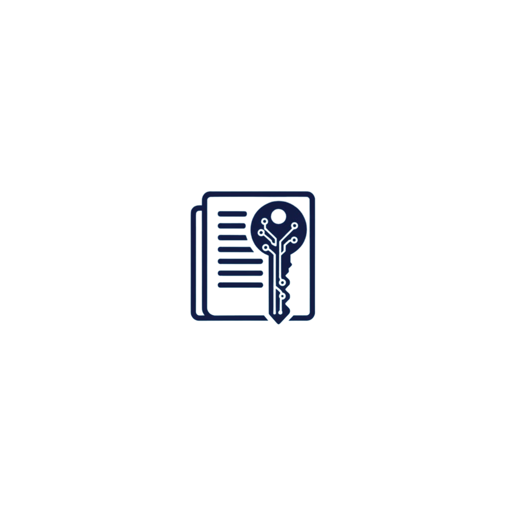

# SIA Mobile Soosvaldo

  
  

  
  
  
  
  

## Ringkasan
Aplikasi Flutter untuk kebutuhan kasir/akuntansi sederhana: barang, customer, membership, POS (nota jual), piutang/cicilan, dan laporan akuntansi. Frontend Flutter terhubung ke API PHP/MySQL.

## Fitur Utama
- 🔐 Login & session karyawan
- 📊 Dashboard metrik bisnis
- 📦 Manajemen Barang
- 🧑‍🤝‍🧑 Customer & Karyawan
- ⭐ Membership & Metode Pembayaran
- 🧾 POS (Nota Jual)
- 💸 Piutang & Cicilan
- 📚 Akuntansi: Jurnal Umum, Buku Besar, Neraca Saldo

## Quick Start
1. Install depedensi: `flutter pub get`
2. Jalankan aplikasi:
   - Windows: `flutter run -d windows`
   - Web: `flutter run -d chrome`
   - Android: emulator/HP tersambung lalu `flutter run`
3. Base URL API ada di `lib/app_config.dart` → `AppConfig.baseUrl`
   - Default: `https://siamobal.soosvaldo.my.id/api/`
   - Untuk lokal: misal `http://localhost/sia_mobile_soosvaldo/api/`

## Konfigurasi Backend (PHP/MySQL)
1. Pindahkan folder `api/` ke server PHP (contoh XAMPP: `C:/xampp/htdocs/sia_mobile_soosvaldo/api`).
2. Edit kredensial DB di `api/config.php` (`$host`, `$user`, `$pass`, `$db`).
3. Import `Database.sql` ke MySQL.
4. Tes endpoint: buka `http://localhost/sia_mobile_soosvaldo/api/get_barang.php` (harus JSON).

## Screenshots (sementara)

  

## Build & Test
- Build APK: `flutter build apk --release`
- Build Web: `flutter build web`
- Test: `flutter test`

## Troubleshooting (cepat)
- 🔌 Tidak bisa konek: cek `AppConfig.baseUrl` dan akses API dari perangkat.
- 🛡️ CORS: sudah diatur di `api/config.php`, pastikan server mengizinkan `OPTIONS`.
- 🧪 JSON error: cek log PHP (atau `api_logs/`) dan validasi data DB.

## Roadmap Ringan
- [ ] Tambah lebih banyak screenshot UI
- [ ] Mode gelap (dark mode)
- [ ] Konfigurasi environment (dev/staging/prod) untuk `AppConfig.baseUrl`
